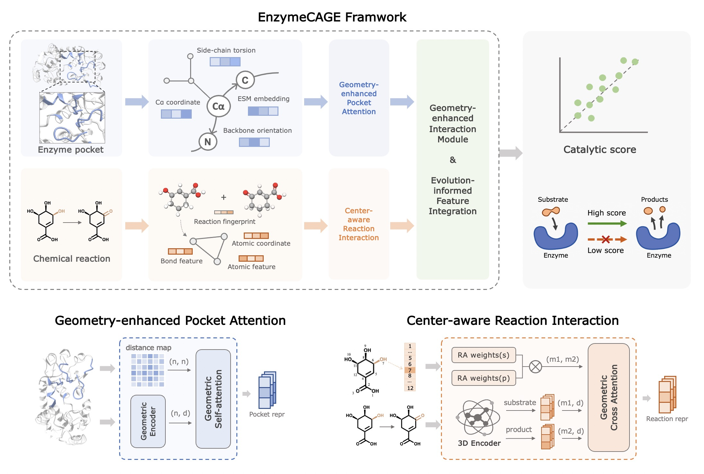

# EnzymeCAGE: A Geometric Foundation Model for Enzyme Retrieval with Evolutionary Insights



## Environment 
```shell
sh setup_env.sh
```

## Dataset
Please download the full dataset [here](https://drive.google.com/file/d/1u2lt4SqAvzoSHKqwzF1DbnPGXfegXYQ2/view?usp=sharing), and pre-trained model checkpoints [here](https://drive.google.com/file/d/1LLsS_MMKEbFpU2iIOF9ro46cO86S-SCt/view?usp=sharing)

Place the downloaded `dataset.zip` and `checkpoints.zip` in the current folder, then unzip them. Next, calculate the protein feature (it is recommended to directly use the reaction feature provided in the data).

```shell
cd feature
python main.py --data_path ../dataset/RHEA/2025-02-05/all_enzymes.csv --pocket_dir ../dataset/RHEA/2025-02-05/pockets/pocket --skip_rxn_feature
```

## Evaluation
We have run AlphaFill and pre-extracted the enzyme pockets from the dataset, and you can directly use this part of the data to reproduce the experimental results.

We have updated the test set. The new version of the data includes two test sets: `Orphan-194` and `Enzyme-405`, which are used to evaluate the enzyme retrieval capability on orphan reactions and the functional prediction capability on novel enzymes, respectively.

### Enzyme-405

```shell
# Inference
python infer.py --config config/infer/Enzyme-405.yaml

# Evaluation
python evaluate.py --result_path ./checkpoints/pretrain/seed_42/Enzyme-405_epoch_19.csv
```

### Orphan-335

```shell

# Retrieve candidate enzymes for orphan reactions
python retrieve.py --data_path dataset/internal-test-set/Orphan-335/Orphan-335.csv --db_path dataset/RHEA/2023-07-12/rhea_rxn2uids.csv

# Inference
python infer.py --config config/infer/Orphan-335.yaml

# Evaluation
python evaluate.py --result_path ./checkpoints/pretrain/seed_42/Orphan-335_retrievel_cands_epoch_19.csv
```

### External test sets

```shell
# Generate feature for external test sets
sh shells/calc_feature_for-ext.sh

# Evaluation on P450 test set
sh shells/evaluate_p450.sh

# Evaluation on Terpene synthase test set
sh shells/evaluate_terpene.sh

# Evaluation on Phosphatase test set
sh shells/evaluate_phosphatase.sh
```

### Glutarate & Withanolide biosynthesis
```shell
# Evaluation on Glutarate biosynthesis dataset
sh shells/evaluate_glutarate.sh

# Evaluation on Withanolide biosynthesis dataset
sh shells/evaluate_withanolide.sh
```


## License
No commercial use of the model or data; see LICENSE for details.

## Citation
Please cite the following preprint when referencing EnzymeCAGE:
```
@article{liu2024enzymecage,
  title={EnzymeCAGE: A Geometric Foundation Model for Enzyme Retrieval with Evolutionary Insights},
  author={Liu, Yong and Hua, Chenqing and Zeng, Tao and Rao, Jiahua and Zhang, Zhongyue and Wu, Ruibo and Coley, Connor W and Zheng, Shuangjia},
  journal={bioRxiv},
  year={2024},
  publisher={Cold Spring Harbor Laboratory}
}
```
