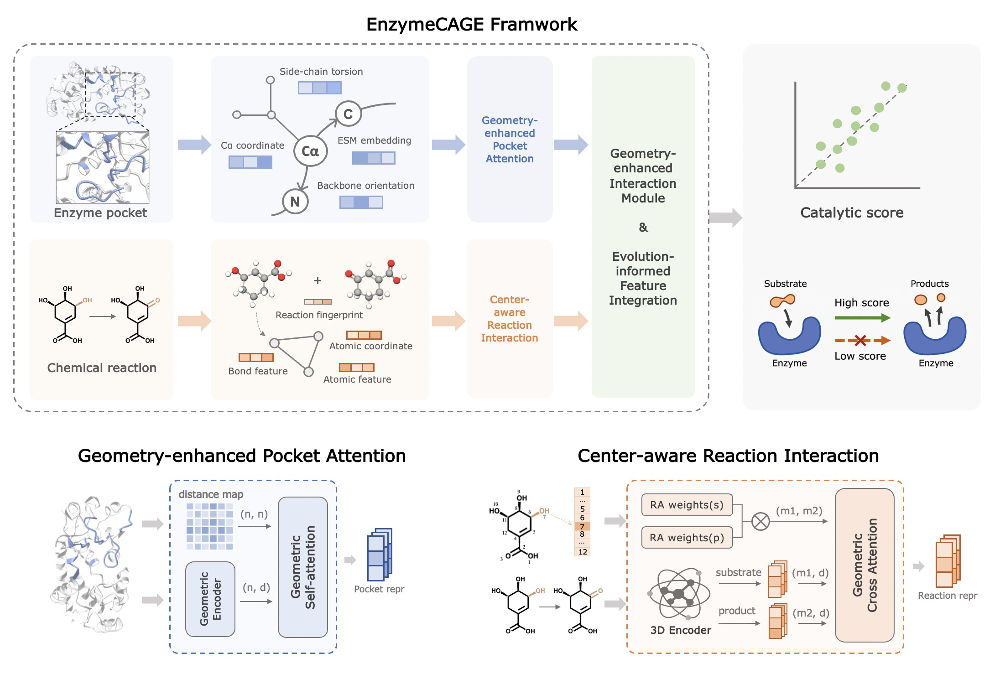

# EnzymeCAGE: A Geometric Foundation Model for Enzyme Retrieval with Evolutionary Insights



## Environment 
```shell
conda create -n enzymecage python=3.10
conda activate enzymecage
sh setup_env.sh
```

For the P2Rank-based mining pipeline below, `P2Rank 2.5.1` requires `Java 17+`.

**Note**: The `setup_env.sh` script specifies a CUDA version when installing PyTorch and related dependencies. If the specified version does not match your server's CUDA version and the environment installation fails, please adjust accordingly. The following two PyTorch versions both work and are provided for reference:
```shell
pip install torch==2.2.0 torch-scatter torch-cluster torch-sparse torch-geometric torchvision -f https://data.pyg.org/whl/torch-2.2.0+cu121.html

pip install torch==2.4.0 torch-scatter torch-cluster torch-sparse torch-geometric torchvision -f https://data.pyg.org/whl/torch-2.4.0+cu124.html
```

## Dataset
Please download the full dataset [here](https://drive.google.com/file/d/1IcuoqpEGhKdLAG9zorKEHQ9RDXSgU3_C/view?usp=sharing), and pre-trained model checkpoints [here](https://drive.google.com/file/d/1LLsS_MMKEbFpU2iIOF9ro46cO86S-SCt/view?usp=sharing)

Place the downloaded `dataset.zip` and `checkpoints.zip` in the current folder, then unzip them. Next, calculate the protein feature (it is recommended to directly use the reaction feature provided in the data).

```shell
cd feature
python main.py --data_path ../dataset/RHEA/2025-02-05/all_enzymes.csv --pocket_dir ../dataset/RHEA/2025-02-05/pockets/pocket --skip_rxn_feature
```

Data cleaning details can be found in the [here](./scripts/README.md).


## Evaluation
We have run AlphaFill and pre-extracted the enzyme pockets from the dataset, and you can directly use this part of the data to reproduce the experimental results.

We have updated the test set. The new version of the data includes two test sets: `Orphan-335` and `Enzyme-405`, which are used to evaluate the enzyme retrieval capability on orphan reactions and the functional prediction capability on novel enzymes, respectively.

### Enzyme-405

```shell
# Inference
python infer.py --config config/infer/Enzyme-405.yaml

# Evaluation
python evaluate.py --result_path ./checkpoints/pretrain/seed_42/Enzyme-405_epoch_19.csv
```

### Orphan-335

```shell

# Retrieve candidate enzymes for orphan reactions
python retrieve.py --data_path dataset/internal-test-set/Orphan-335/Orphan-335.csv --db_path dataset/RHEA/2023-07-12/rhea_rxn2uids.csv

# Inference
python infer.py --config config/infer/Orphan-335.yaml

# Evaluation
python evaluate.py --result_path ./checkpoints/pretrain/seed_42/Orphan-335_retrievel_cands_epoch_19.csv --pos_pair_db_path dataset/RHEA/2025-02-05/rhea_rxn2uids.csv
```

### External test sets

```shell
# Generate feature for external test sets
sh shells/calc_feature_for-ext.sh

# Evaluation on P450 test set
sh shells/evaluate_p450.sh

# Evaluation on Terpene synthase test set
sh shells/evaluate_terpene.sh

# Evaluation on Phosphatase test set
sh shells/evaluate_phosphatase.sh
```

### Glutarate & Withanolide biosynthesis
```shell
# Evaluation on Glutarate biosynthesis dataset
sh shells/evaluate_glutarate.sh

# Evaluation on Withanolide biosynthesis dataset
sh shells/evaluate_withanolide.sh
```

## Mining With Your Own Reaction or Enzyme Candidates
This workflow is intended for enzyme mining from a reaction, or reaction mining for a specific enzyme, as long as you can provide:

- a reaction CSV containing `CANO_RXN_SMILES`
- a structure directory containing candidate enzyme structures named as `<UniprotID>.pdb` or `<UniprotID>.cif`

The repository includes a minimal demo in `dataset/demo`, which contains one reaction and five candidate enzyme structures.

### 1. Install P2Rank
Running Alphafill can be relatively complicated; you can use P2Rank as an alternative to extract enzyme pockets. Here are the steps to install P2Rank:

```shell
mkdir -p tools
cd tools
wget https://github.com/rdk/p2rank/releases/download/2.5.1/p2rank_2.5.1.tar.gz
tar zxvf p2rank_2.5.1.tar.gz
cd ..
```

Check your Java runtime before running P2Rank:
```shell
java -version
```

If your Java version is lower than 17, please update Java:
```shell
sudo apt update
sudo apt install openjdk-17-jdk
```

If you are using AlphaFold/AlphaFill structures, the pipeline uses the `alphafold` profile of P2Rank.

### 2. Build the EnzymeCAGE input CSV
Starting from `dataset/demo/reaction.csv` and `dataset/demo/structures`, generate the standard EnzymeCAGE pair CSV:

```shell
python scripts/prepare_mining_input.py \
  --reaction_path dataset/demo/reaction.csv \
  --structure_dir dataset/demo/structures \
  --output_csv dataset/demo/mining.csv
```

This writes:

- `dataset/demo/mining.csv`: pair table used by feature generation and inference
- `dataset/demo/candidate_enzymes.csv`: extracted enzyme table with `UniprotID`, `sequence`, and `structure_path`

If you already have a complete CSV with `UniprotID`, `sequence`, and `CANO_RXN_SMILES`, you can skip this step and use it directly as `--input_csv`.

### 3. Run P2Rank and extract pocket structures
```shell
python scripts/extract_p2rank_pockets.py \
  --input_csv dataset/demo/mining.csv \
  --structure_dir dataset/demo/structures \
  --p2rank_home tools/p2rank_2.5.1 \
  --output_dir dataset/demo/pocket/p2rank \
  --threads 4
```

This step keeps the raw P2Rank output under `dataset/demo/pocket/p2rank/raw/`, extracts the top-ranked pocket of each structure into `dataset/demo/pocket/p2rank/pocket/`, and writes `dataset/demo/pocket/p2rank/pocket_info.csv`.

### 4. Generate EnzymeCAGE features
```shell
cd feature
python main.py \
  --data_path ../dataset/demo/mining.csv \
  --pocket_dir ../dataset/demo/pocket/p2rank/pocket
cd ..
```

If you rerun only the pocket step and want to reuse the reaction features, add `--skip_rxn_feature`.

### 5. Run inference
```shell
python infer.py --config config/demo/infer.yaml
```

The demo config uses `checkpoints/pretrain/seed_42/best_model.pth` and writes predictions to `dataset/demo/predictions/`.

### One-command demo pipeline
The whole demo can also be run by:

```shell
python scripts/run_mining_pipeline.py \
  --data_dir dataset/demo \
  --p2rank_home tools/p2rank_2.5.1 \
  --checkpoint_dir checkpoints/pretrain/seed_42 \
  --model_name best_model.pth
```

This command creates the pair CSV, runs P2Rank, generates features, runs inference, and writes a ranked result table to `dataset/demo/predictions/mining_best_model_ranked.csv`.

For the bundled demo, there is also a shell wrapper:

```shell
bash shells/run_demo_mining.sh
```

## License
No commercial use of the model or data; see LICENSE for details.

## Citation
Please cite the following preprint when referencing EnzymeCAGE:
```
@article{liu2026geometric,
  title={A geometric foundation model for enzyme retrieval with evolutionary insights},
  author={Liu, Yong and Hua, Chenqing and Xu, Menglong and Zeng, Tao and Rao, Jiahua and Zhang, Zhongyue and Wu, Ruibo and Weng, Jing-Ke and Coley, Connor W and Zheng, Shuangjia},
  journal={Nature Catalysis},
  pages={1--13},
  year={2026},
  publisher={Nature Publishing Group UK London}
}
```
